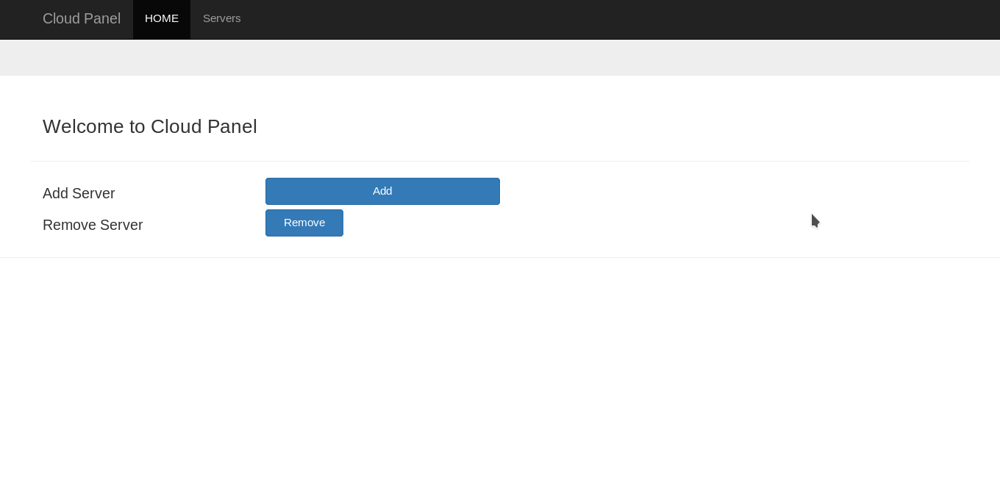
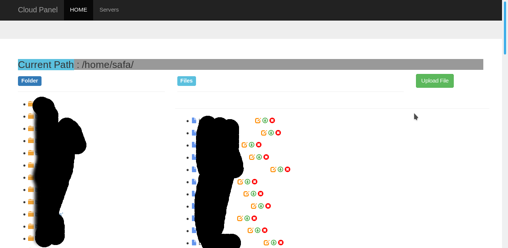

# Cloud Management Panel



The project manages files and directories to remote servers. The main pages wants register to your server information. Afterthat the new page open and you can see files and directories.

You can delete, upload, create, download the all matters. The system on development mode right now. So you're just using for development.

I used PostgreSQL 11 you should use upper versions of PostgreSQL.

You need to install the python3-dev package in debian or Redhat systems.

```shell
sudo apt install python3-dev
sudo yum install python3-dev
```

Virtualenv should be install in system.

```shell
virtualenv cloud
. cloud/bin/activate
pip install -r requirements.txt
```

PostgreSQL wants to access to cloud database. So, you need create user, password and database for clouds.

```shell
create user TEST with password 'TEST'
create database cloudpanel owner TEST;
```

Tables need to create in PostgreSQL. You should run this command.

```shell
python manage.py migrate
```

Super user purpose access to admin page. That wants to information of admin user.

```shell
python manage.py createsuperuser
```

Run the web application;

```shell
python manage.py runserver
```


